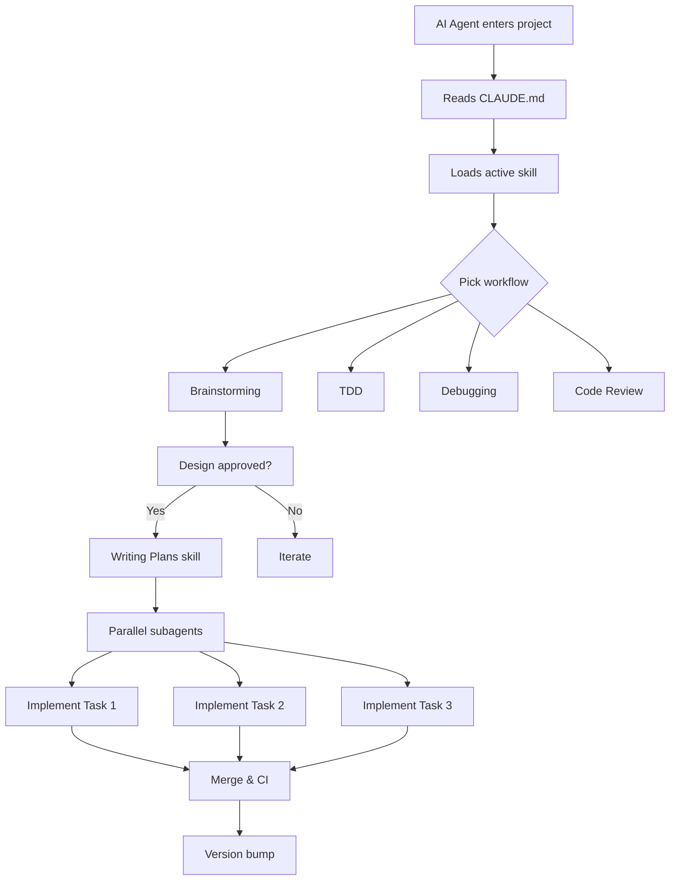
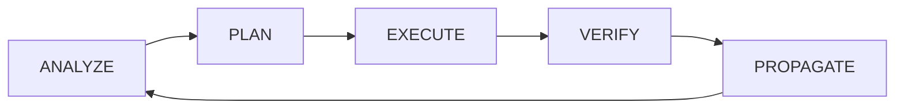

# agentic-scaffold

**A project scaffold designed for AI-agent collaboration.**  
Stop repeating instructions to your AI — this template tells it everything.

[](https://github.com/doganbulut/agentic-scaffold/actions/workflows/ci.yml)
[](LICENSE)

[](https://www.typescriptlang.org/)

---

## The Problem

Every project onboarding repeats the same ritual: _"This is a TypeScript project. We use Vitest. Don't add type ignores. Run CI before pushing."_

Each new AI session, each new contributor — the same instructions. They accumulate in READMEs, fade into wiki pages, and rot in team chats.

## The Solution

**agentic-scaffold** embeds your rules, conventions, and workflows into the project structure itself. The AI reads them on entry and adapts. No repeating. No drift. No "I forgot to tell you."



## Features

- **Zero-instruction onboarding** — CLAUDE.md tells the AI everything: architecture principles, coding conventions, test requirements, versioning rules
- **5 built-in skills** — brainstorming, TDD, systematic debugging, writing-plans, code-review — each with defined workflows
- **Subagent delegation** — template prompts for spawning parallel workers on bounded tasks
- **Permission boundaries** — `.claude/settings.json` defines exactly what the AI can read, write, and execute
- **Parallel CI** — 6 GitHub Actions checks (suppression grep, format, lint, type check, tests, e2e) + matching local scripts for Unix and Windows
- **ADR-first docs** — architecture decisions recorded as lightweight ADRs in `docs/adr/`
- **Memory system** — persistent agent memory in `memory/` (gitignored) so the AI remembers across sessions
- **Semver enforcement** — production changes must bump version; the AI enforces this

## Quick Start

```bash
# Create a new project from the template
git clone https://github.com/doganbulut/agentic-scaffold my-project
cd my-project

# Install
npm install

# Set up (initializes git, renames project)
npm run setup

# Verify everything works
npm run ci:win        # Windows
# or
./scripts/ci.sh       # Unix

# Start building
npm run dev
```

## Project Structure

```
.
├── .claude/                          # AI agent infrastructure
│   ├── agents/                       # Subagent prompt templates
│   │   ├── implementer.md            #   For bounded implementation tasks
│   │   └── reviewer.md               #   For spec compliance + quality review
│   ├── skills/                       # Skill definitions
│   │   ├── brainstorming/            #   Design-first: no code without design
│   │   ├── tdd/                      #   Red → Green → Refactor
│   │   ├── systematic-debugging/     #   Root-cause before fix
│   │   ├── writing-plans/            #   Decompose design into tasks
│   │   └── code-review/              #   Spec compliance + quality gate
│   ├── hooks/                        # Git hooks with agent behavior
│   └── plans/                        # Implementation task breakdowns
├── scripts/                          # CI scripts
│   ├── ci.sh                         #   Unix (bash)
│   └── ci.ps1                        #   Windows (PowerShell)
├── docs/                             # Documentation
│   ├── adr/                          #   Architecture Decision Records
│   ├── specs/                        #   Feature specifications
│   └── guides/                       #   How-to guides
├── src/                              # Source code
│   ├── core/                         #   Shared utilities
│   ├── features/                     #   Domain features
│   └── engine/                       #   Domain logic
├── e2e/                              # End-to-end tests
├── init/                             # Project scaffolding scripts
├── memory/                           # Persistent agent memory (gitignored)
├── CLAUDE.md                         # Agent directive (rules + principles)
└── AGENTS.md                         # Mirror of CLAUDE.md
```

## Skills in Detail

| Skill                    | When                       | Behavior                                                                                |
| ------------------------ | -------------------------- | --------------------------------------------------------------------------------------- |
| **brainstorming**        | Before any creative work   | Design-first: no code without approved design. Proposes 2-3 approaches with trade-offs. |
| **tdd**                  | When implementing features | Red → Green → Refactor. Failing test first, simplest implementation, then clean up.     |
| **systematic-debugging** | When fixing bugs           | Root-cause analysis → regression test → minimal fix → verify → check siblings.          |
| **writing-plans**        | After design approval      | Decomposes approved design into ordered, implementable tasks with dependencies.         |
| **code-review**          | Before merging             | Spec compliance audit + code quality review. Critical/Important/Minor severity rating.  |

## AI Workflow

The cognitive workflow enforced by CLAUDE.md:



1. **ANALYZE** — Read relevant files. Do not guess.
2. **PLAN** — Map logic. Identify root cause. Order by dependency.
3. **EXECUTE** — Fix the cause, not the symptom. One change at a time.
4. **VERIFY** — Run CI. Confirm fix.
5. **PROPAGATE** — Changes cascade. Update all impacted files.

## CI Pipeline

```yaml
# 6 parallel checks on every push/PR
Ban type ignores   →   Format check   →   Lint   →   Type check   →   Tests   →   E2E
```

Run locally:

```bash
./scripts/ci.sh              # Unix
.\scripts\ci.ps1             # Windows
./scripts/ci.sh --only test  # Run only tests
```

## Architecture Principles

1. **Shared core** — Shared utilities in `src/core/`. No cross-module duplication.
2. **DRY** — Extract shared classes. Composition over copy-paste.
3. **Encapsulation** — Accessor methods for internal state.
4. **Dead code** — Remove unused code in the same change. No compat shims.
5. **Type safety** — Fix type issues. Never add `# type: ignore`.
6. **YAGNI** — Nothing extra. Nothing half-finished.
7. **Modularity** — One clear responsibility per file.
8. **Testing** — Real behavior verified. No mocks for external integration.

## Comparison: Why Not Just...

| Approach                         | Problem                                                             |
| -------------------------------- | ------------------------------------------------------------------- |
| **README + verbal instructions** | Degrades over time, no enforcement, every agent re-learns           |
| **Husky + commit hooks only**    | Covers git lifecycle but leaves agent behavior unconstrained        |
| **Copilot instructions only**    | Single-agent focus; no subagent delegation, no CI integration       |
| **agentic-scaffold**             | Full lifecycle: agent rules → skills → delegation → CI → versioning |

## Who Is This For?

- **Teams using AI coding agents** (Claude Code, Copilot, Cursor) who want consistent behavior
- **Open-source projects** that want contributors' AI agents to follow project conventions automatically
- **Solo developers** who work across multiple sessions and don't want to re-explain context
- **Anyone tired of writing the same instructions**

## License

MIT — see [LICENSE](LICENSE).

---

**Built for humans. Designed for agents.**
