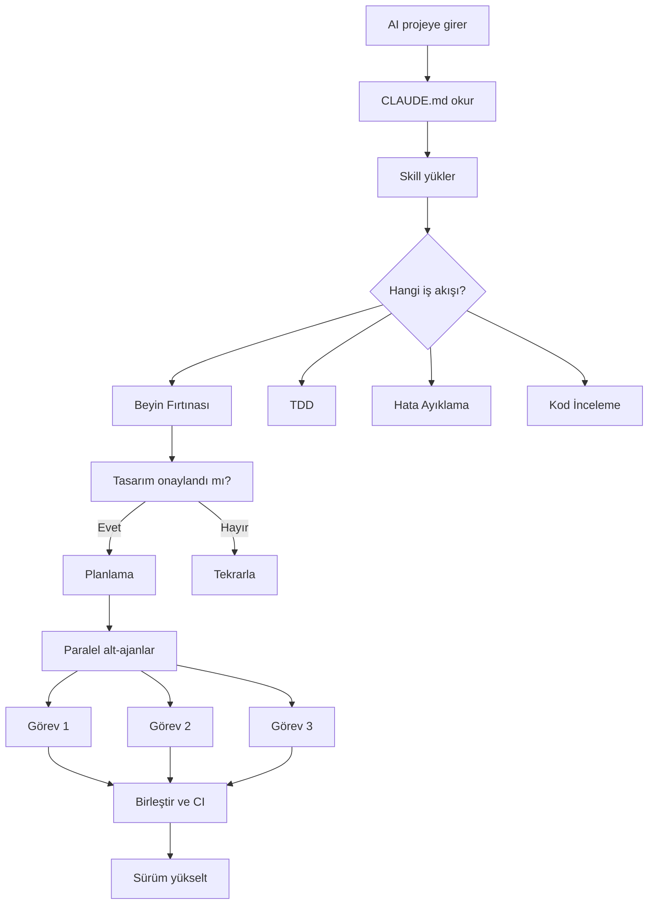
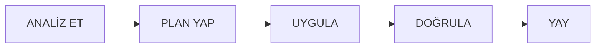

# agentic-scaffold

**Yapay zeka ajanlarıyla işbirliği için tasarlanmış proje şablonu.**  
AI asistanına talimatları tekrar tekrar söylemeyi bırak — bu şablon her şeyi ona söyler.

[](https://github.com/doganbulut/agentic-scaffold/actions/workflows/ci.yml)
[](LICENSE)

[](https://www.typescriptlang.org/)

[English](README.md) | **Türkçe**

---

## Sorun

Her yeni projede aynı ritüeli tekrarlıyorsun: *"Bu bir TypeScript projesi. Vitest kullanıyoruz. type ignore ekleme. Push'tan önce CI çalıştır."*

Her yeni AI oturumu, her yeni katkıda bulunan — aynı talimatlar. README'lerde birikir, wiki sayfalarında solar, ekip sohbetlerinde kaybolur.

## Çözüm

**agentic-scaffold** kurallarınızı, alışkanlıklarınızı ve iş akışlarınızı doğrudan proje yapısına gömer. AI projeye girer, okur ve adapte olur. Tekrarlama yok. Unutma yok. "Sana söylemeyi unuttum" yok.



## Özellikler

- **Sıfır talimatla başlangıç** — CLAUDE.md AI'ya her şeyi söyler: mimari prensipler, kodlama kuralları, test gereksinimleri, sürümleme kuralları
- **5 yerleşik skill** — beyin fırtınası, TDD, sistematik hata ayıklama, plan yazma, kod inceleme — her biri tanımlı iş akışına sahip
- **Alt-ajan delegasyonu** — sınırlı görevler için paralel çalışan şablon prompt'lar
- **İzin sınırları** — `.claude/settings.json` AI'nın okuyabileceği, yazabileceği ve çalıştırabileceği alanları tanımlar
- **Paralel CI** — 6 GitHub Actions kontrolü (suppression grep, format, lint, type check, tests, e2e) + Unix ve Windows için yerel betikler
- **ADR-öncelikli dökümantasyon** — mimari kararlar `docs/adr/` altında hafif ADR'ler olarak kaydedilir
- **Bellek sistemi** — `memory/` (gitignore'da) AI'nın oturumlar arası hatırlaması için kalıcı ajan belleği
- **Semver zorunluluğu** — üretim değişiklikleri versiyon yükseltmesi gerektirir; AI bunu denetler

## Hızlı Başlangıç

```bash
# Şablonu kopyala
git clone https://github.com/doganbulut/agentic-scaffold benim-projem
cd benim-projem

# Bağımlılıkları yükle
npm install

# Kurulum (git init, proje adını güncelle)
npm run setup

# Her şey çalışıyor mu kontrol et
npm run ci:win        # Windows
# veya
./scripts/ci.sh       # Unix

# Geliştirmeye başla
npm run dev
```

## Proje Yapısı

```
.
├── .claude/                          # AI ajan altyapısı
│   ├── agents/                       # Alt-ajan prompt şablonları
│   │   ├── implementer.md            #   Sınırlı görevler için
│   │   └── reviewer.md               #   Spec uyum + kalite incelemesi için
│   ├── skills/                       # Skill tanımları
│   │   ├── brainstorming/            #   Önce tasarım, kodsuz tasarım olmaz
│   │   ├── tdd/                      #   Kırmızı → Yeşil → Yeniden Düzenle
│   │   ├── systematic-debugging/     #   Önce kök neden, sonra çözüm
│   │   ├── writing-plans/            #   Tasarımı görevlere böl
│   │   └── code-review/              #   Spec uyum + kalite kontrolü
│   ├── hooks/                        # Git hook'ları (ajan davranışlı)
│   └── plans/                        # Görev dökümleri
├── scripts/                          # CI betikleri
│   ├── ci.sh                         #   Unix (bash)
│   └── ci.ps1                        #   Windows (PowerShell)
├── docs/                             # Dökümantasyon
│   ├── adr/                          #   Mimari Karar Kayıtları
│   ├── specs/                        #   Özellik spesifikasyonları
│   └── guides/                       #   Nasıl yapılır rehberleri
├── src/                              # Kaynak kodu
│   ├── core/                         #   Paylaşılan yardımcılar
│   ├── features/                     #   Domain özellikleri
│   └── engine/                       #   Domain mantığı
├── e2e/                              # Uçtan uca testler
├── init/                             # Proje kurulum betikleri
├── memory/                           # Kalıcı ajan belleği (gitignore'da)
├── CLAUDE.md                         # Ajan yönergesi (kurallar + prensipler)
└── AGENTS.md                         # CLAUDE.md'in kopyası
```

## Skill'ler Detaylı

| Skill | Ne Zaman | Davranış |
|-------|----------|----------|
| **beyin fırtınası** | Yaratıcı çalışmalardan önce | Önce tasarım: onaysız kod yok. 2-3 yaklaşım önerir, artılarını/eksilerini sunar. |
| **tdd** | Özellik geliştirirken | Kırmızı → Yeşil → Yeniden Düzenle. Önce başarısız test, sonra en basit çözüm. |
| **sistematik hata ayıklama** | Hata düzeltirken | Kök neden analizi → regresyon testi → minimal düzeltme → doğrulama → kardeş hataları kontrol. |
| **plan yazma** | Tasarım onayından sonra | Onaylı tasarımı sıralı, uygulanabilir görevlere böler, bağımlılıkları belirler. |
| **kod inceleme** | Birleştirmeden önce | Spec uyum denetimi + kod kalitesi. Kritik/Önemli/Minor önem derecelendirmesi. |

## AI İş Akışı

CLAUDE.md tarafından zorunlu kılınan bilişsel iş akışı:



1. **ANALİZ ET** — İlgili dosyaları oku. Tahmin etme.
2. **PLAN YAP** — Mantığı haritala. Kök nedeni bul. Bağımlılıklara göre sırala.
3. **UYGULA** — Semptomu değil, nedeni düzelt. Her seferinde bir değişiklik.
4. **DOĞRULA** — CI çalıştır. Düzeltmeyi onayla.
5. **YAY** — Değişiklikler basamaklanır. Etkilenen tüm dosyaları güncelle.

## CI Pipeline

```yaml
# Her push/PR'da 6 paralel kontrol
type ignore yasak   →   Format kontrol   →   Lint   →   Type check   →   Testler   →   E2E
```

Yerel çalıştırma:

```bash
./scripts/ci.sh              # Unix
.\scripts\ci.ps1             # Windows
./scripts/ci.sh --only test  # Sadece testleri çalıştır
```

## Mimari Prensipler

1. **Paylaşılan çekirdek** — Ortak yardımcılar `src/core/` altında. Modüller arası tekrar yok.
2. **DRY** — Ortak sınıfları çıkar. Kopyala-yapıştır yerine kompozisyon.
3. **Kapsülleme** — İç durum için erişim metotları kullan.
4. **Ölü kod** — Kullanılmayan kodu aynı değişiklikte temizle. Uyumluluk kırıntısı bırakma.
5. **Tip güvenliği** — Tip sorunlarını düzelt. Asla `# type: ignore` ekleme.
6. **YAGNI** — Fazladan hiçbir şey. Yarı bitmiş hiçbir şey.
7. **Modülerlik** — Her dosya tek bir sorumluluk taşır.
8. **Test** — Gerçek davranış test edilir. Dış entegrasyonlar için mock kullanılmaz.

## Karşılaştırma

| Yaklaşım | Sorun |
|----------|-------|
| **README + sözlü talimatlar** | Zamanla bozulur, denetimsizdir, her ajan yeniden öğrenir |
| **Sadece Husky + commit hook'ları** | Git yaşam döngüsünü kapsar ama ajan davranışını denetimsiz bırakır |
| **Sadece Copilot talimatları** | Tek ajana odaklıdır, alt-ajan delegasyonu ve CI entegrasyonu yoktur |
| **agentic-scaffold** | Tam yaşam döngüsü: ajan kuralları → skill'ler → delegasyon → CI → sürümleme |

## Bu Kimin İçin?

- **AI kodlama ajanları kullanan ekipler** (Claude Code, Copilot, Cursor) — tutarlı davranış isteyenler
- **Açık kaynak projeler** — katkıda bulunanların AI ajanlarının proje kurallarına otomatik uymasını isteyenler
- **Birden çok oturumda çalışan bireysel geliştiriciler** — bağlamı tekrar anlatmak istemeyenler
- **Aynı talimatları yazmaktan bıkan herkes**

## Lisans

MIT — [LICENSE](LICENSE) dosyasına bakın.

---

**İnsanlar için inşa edildi. Ajanlar için tasarlandı.**
